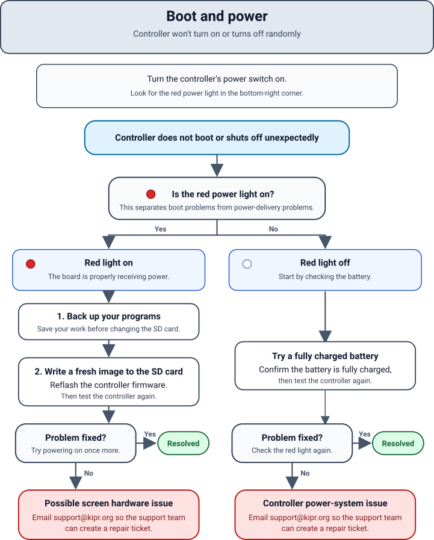
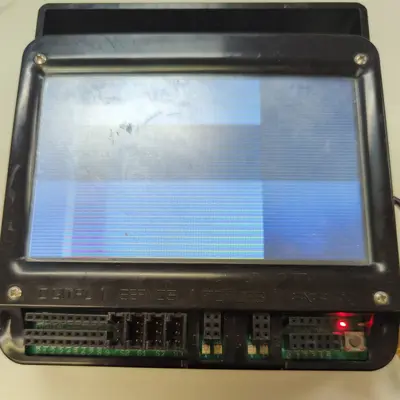

+++
title = 'Boot and power'
description = "Controller won't turn on or turns off randomly"
+++

## Diagnosing

Boot and power issues can be divided into two categories depending on whether the board is receiving power.
To distinguish, turn your controller's power switch to on and look for the red light in the bottom right corner.

## Red Light On

If the red light is on, the board is properly receiving power.

1. [Back up your programs](/docs/backup_programs/).
1. [Write a fresh image to the SD card](/docs/firmware_reflash/).

If this doesn't fix the problem, then it is most likely an issue with the screen hardware.
In this case, 

## Red Light Off

Try a fully charged battery.
You can check the charge level by the lights on the charger included with your kit.

If this doesn't fix the problem, the problem lies somewhere in the controller's power system.
In this case, 
