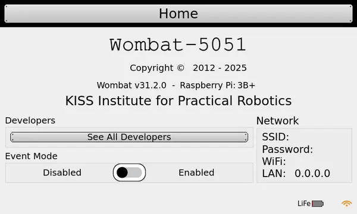

+++
title = "I can't connect to the controller"
description = "The computer won't connect to the controller"
+++

## Diagnosing

This is a very broad issue with several possible causes.
Refer to the pages below to narrow it down.
First, navigate the BotUI *About* page and check if your controller displays an SSID and IP address (WiFi line).

## Non-empty SSID

First, verify that your computer is connected to the correct network.

(image with matching SSIDs)

Next, check that you are visiting the correct IP address.

(image with matching IP)

## IDE stuck loading forever

1. Update
2. Try another device (phone, etc.).
3. If phone works, you school is probably blocking the IP address. Submit a request for them to unblock it.
4. Go outside.

If you are on a version before  and are in a crowded area with many controllers, you may be affected by signal congestion.
Try moving to a less crowded room or even stepping outside to allow the IDE to load.
You can permanently solve this problem by updating the the latest version with the [instructions here](https://www.kipr.org/kipr/hardware-software/kipr-wombat-firmware).

Finally, if you are on a device managed by your school or company, they may have blocked the IP address.
Verify by accessing the IDE on a personal device like your phone.
If it works on your phone, you'll need to submit a request to them to unblock the controller's address.

## Empty SSID

If the *SSID*, *Password*, and *IP Address* lines in the about page are empty, there are a couple fixes.

This is a known issue on versions 31.0.0-31.1.2 and is fixed on the latest version.

**Solution 1**:

The best option is to update.
Refer to the [update instructions](https://www.kipr.org/kipr/hardware-software/kipr-wombat-firmware).

**Solution 2**:

Click on *Settings > Hide UI*.
In the top right corner of the screen there is an icon that looks like a red "X".
Tap it, then tap "Enable Network."
Wait a moment, the select the network name that matches your controller's serial number.
Tap "Settings" to return to BotUI, then navigate to the about page.
The network information should be available.

> [!TIP]
> This is not a permanent solution and it will almost certainly break again.
> KIPR always recommends running the latest version (currently ).

