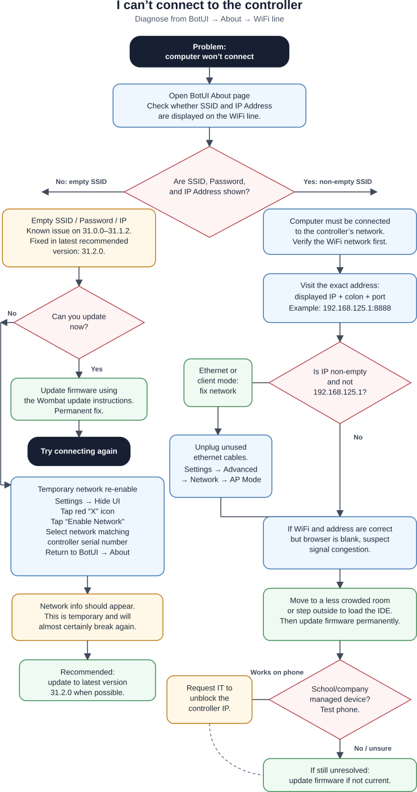

+++
title = "I can't connect to the controller"
description = "The computer won't connect to the controller"
+++

## Diagnosing

This is a very broad issue with several possible causes.
Refer to the pages below to narrow it down.
First, navigate the BotUI *About* page and check if your controller displays an SSID and IP address (WiFi line).

## Non-empty SSID

Short version:

1. Verify that your computer is connected to the correct network.
1. Verify that you are visiting the correct address.
1. Unplug unused ethernet cables.
1. Ensure the controller is in AP mode, not client mode.
1. Try moving to a less crowded area.
1. If your controller isn't on the latest version, update it.

First, verify that your computer is connected to the correct network.
Next, check that you are visiting the correct address.
You must always include *both* the displayed IP address followed by a colon and the port:

If your IP address is not empty *and* is not `192.168.125.1`, then you are either in ethernet mode or client mode.
Unplug any ethernet cables from the controller, then go to *Settings > Advanced > Network* and ensure the dropdown on the left says "AP Mode."

If you have connected to the correct network and the address is correct, but the browser simply displays a blank screen, you may be affected by signal congestion.
Try moving to a less crowded room or even stepping outside to allow the IDE to load.
You can permanently solve this problem by updating the latest version with the [instructions here](https://www.kipr.org/kipr/hardware-software/kipr-wombat-firmware).

Finally, if you are on a device managed by your school or company, they may have blocked the IP address.
Verify by accessing the IDE on a personal device like your phone.
If it works on your phone, you'll need to submit a request to them to unblock the controller's address.

## Empty SSID

If the *SSID*, *Password*, and *IP Address* lines in the about page are empty as in the image above, there are a couple of possible fixes.

This is a known issue on versions 31.0.0–31.1.2 and is fixed on the latest version.
If you have time to update, that is the recommended, permanent solution.
Refer to the [update instructions](https://www.kipr.org/kipr/hardware-software/kipr-wombat-firmware).

If not, you can fix it temporarily:

1. Click on *Settings > Hide UI*.
1. In the top right corner of the screen there is an icon that looks like a red "X".
1. Tap it, then tap "Enable Network."
1. Wait a moment, the select the network name that matches your controller's serial number.
1. Tap "Settings" to return to BotUI, then navigate to the about page.
1. The network information should be available.

> [!TIP]
> This is not a permanent solution and it will almost certainly break again.
> KIPR always recommends running the latest version (currently ).

