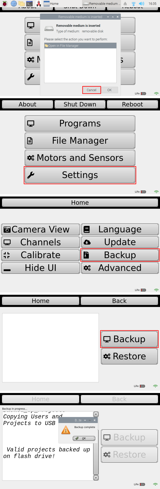
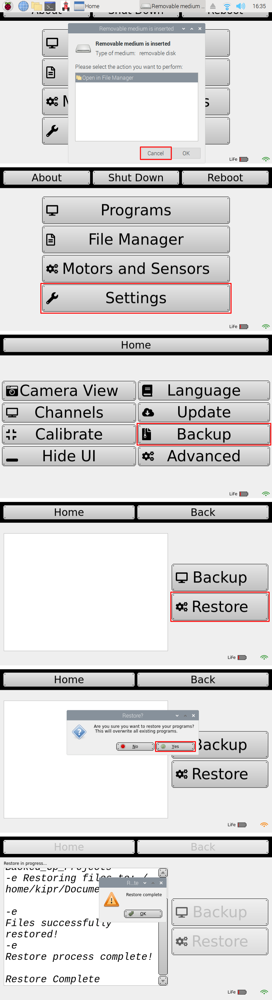
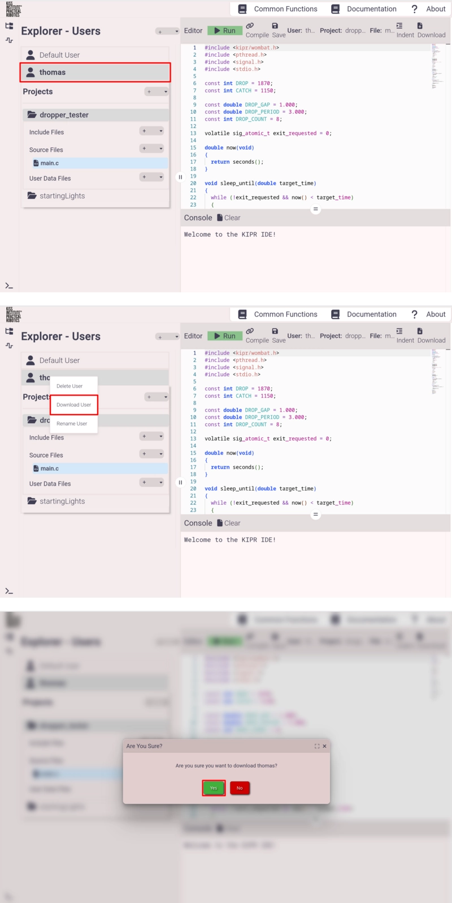
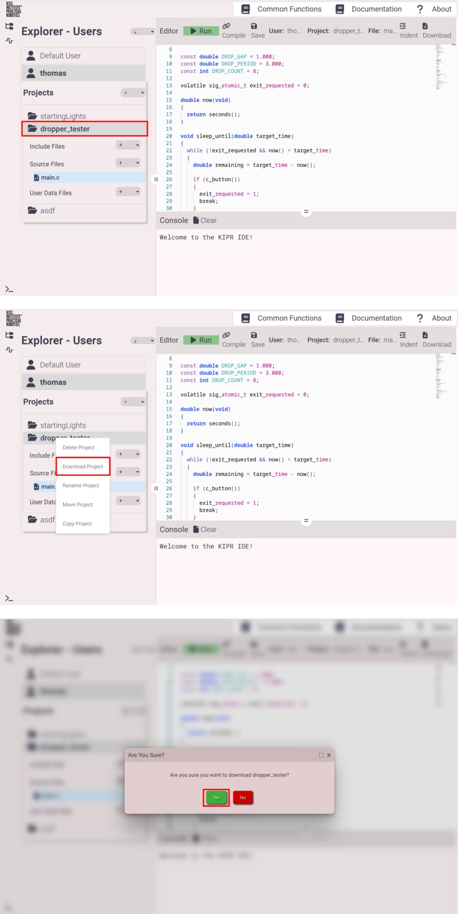
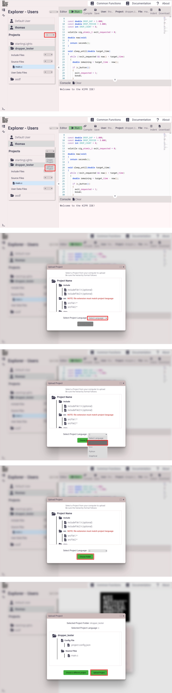

+++
title = 'Backup and Restore Programs'
description = 'Instructions for backing up programs stored on the KIPR controller'
+++

## Method 1: USB

This is the simplest method and is the KIPR recommended way to back up and restore all of your programs.

Requirements:

- USB drive formatted with the FAT32 filesystem ([what is a filesystem?](/docs/filesystems/)).
- Bootable controller

### Backup

The KIPR controller has a button to back up programs onto a USB.

1. Power on the controller.
1. Plug the USB drive into the controller.
1. Select **Cancel** on the popup.
1. Click **Settings**.
1. Click **Backup**.
1. Click **Backup**.
1. After a moment, it should say "Backup complete."

### Restore

You can directly restore the programs created by a backup in the previous step.

> [!CAUTION]
> Restoring programs in this manner will overwrite all existing programs.

1. Power on the controller.
1. Plug the USB drive into the controller.
1. Select **Cancel** on the popup.
1. Click **Settings**.
1. Click **Backup**.
1. Click **Restore**.
1. If you want to overwrite all existing programs with the backup, click **Yes**.
1. After a moment, it should say "Restore complete."

## Method 2: IDE, User Backup

This method allows you to download a single user and has the benefit that you don't need an extra USB drive.
However, you can only download a single user at a time, so it can be cumbersome if you have many users to back up.

Requirements:

- Bootable controller

### Backup

1. Right-click on the user in the browser.
1. Click **Download User**.
1. Click **Yes** on the popup confirmation.

### Restore

1. Click the **+** dropdown.
1. Click the **Upload User**.
1. Select the user's interface mode (in this example, Advanced).
1. Click **Choose Folder** and choose the folder you downloaded during the backup phase.
1. Click **Upload User**.

## Method 3: IDE, Project Backup

This is mostly the same as the previous procedure, but you are only backing up one project at a time instead of one user.
It can be useful if you want more fine-grained control.

Requirements:

- Bootable controller

### Backup

1. Right-click on the project in the browser.
1. Click **Download Project**.
1. Click **Yes** on the popup confirmation.

### Restore

1. Click the **+** dropdown.
1. Click **Upload Project**.
1. Click the **Select Language** dropdown.
1. Select your language (in this example, C).
1. Click **Choose Folder** and choose the folder you downloaded during the backup phase.
1. Click **Upload Project**.

## Method 3: Copy-Paste

You can copy-paste the code into, say, a Google Doc.
This is extremely simple, but I *strongly* recommend against using this method.

Firstly, the system clipboard is not a purely neutral vehicle for data storage.
It can mess with whitespace (tabs and spaces), newlines/line endings, character encoding, and can even insert invisible control characters.

Secondly, inserting the code into a program like Google Docs *will* break the formatting (tabs, spaces, newlines, etc.) can also insert invisible characters that cause strange compilation errors when you try to paste it back into the IDE.
You can achieve slightly better results using a simpler program like Notepad on Windows or TextEdit on Mac, but this is still vulnerable to the clipboard issues mentioned above.
